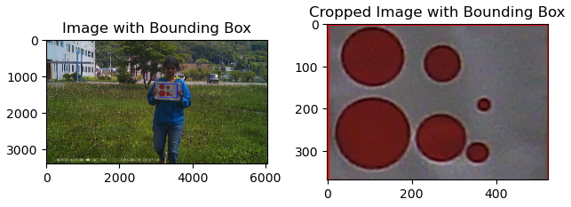
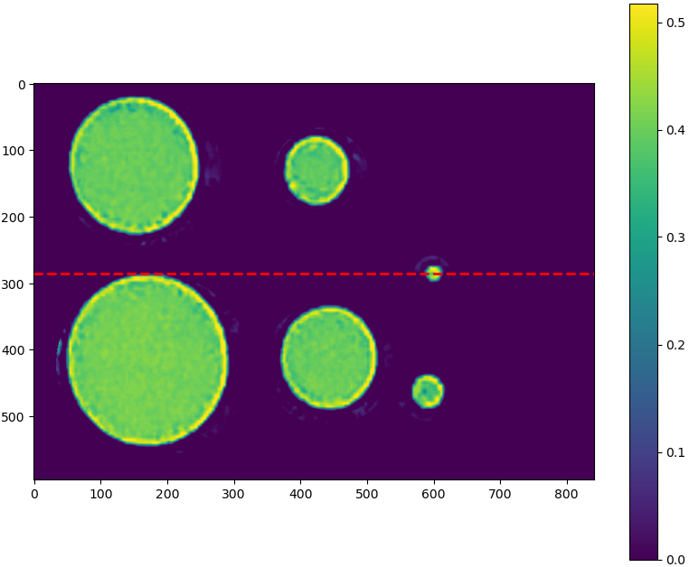
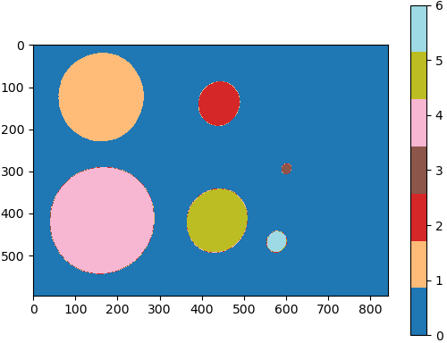
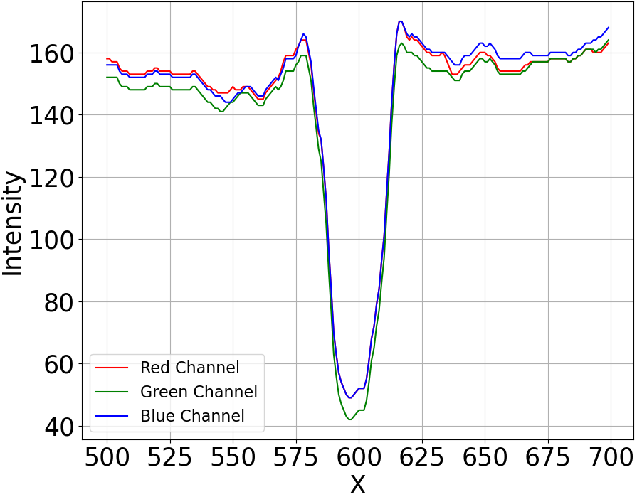

__Muroran IT: "Advancing Sika Deer Detection and Distance Estimation through Comprehensive Camera Calibration and Distortion Analysis"__

**Template Matching**
We utilized an A4-sized template featuring six circles of varying diameters (1 cm, 2 cm, 4 cm, 6 cm, 8 cm, 10 cm), each captured at different distances within the camera trap's Field of View (FOV). We performed template matching algorithm that automatically identify the templates preent in image and creates a rectangular bounding box in the matched template in the image. This cropped matched template was then automatically saved in the specified folder.

    

    

**Camera Calibration**

 Our research specifically concentrated on the 1 cm diameter circle, as visual inspection revealed that all other diameter circles were successfully captured by the camera traps, except for the 1 cm circle diameter. Furthermore, the 1 cm circle diameter closely resembled the size of Sika deer spots. The camera calibration algorithm employed in this study precisely measures the diameter of the 1 cm circle size in pixels. Additionally, we generated a line along the y-axis that overlays the diameter of the 1 cm circle to extract the intensity line profile.

  
  
   

**Distortion Calibration**
We captured images of chessboard pattern using three different camera trap models. We then performed distortion calibration algorithm to extract intrinsic and extrinsic parameters along with the distortion coefficients to undistort or correct the distorted original images captured by camera trap models.

  
  

**Implementation**
This research can be supported by Python version above 3.7.13. Install all the required dependencies from requirement.txt and all the captured images should be kept in "full_images" sub-folder located inside the "data" folder for the template matching. The matches will then be automatically cropped and saved in the sub-folder "images". This cropped images should then be used for diameter measurement of circles using camera calibration algorithm and gaussian curve measurement. Despite, the chessboard images should be kept inside "chessboard" subfolder located inside the "data" folder and performed the distortion analysis algorithm for extracting the intrinsic and extrinsic parameters with distortion coefficients. The distortion calibration alogithm with code for undistorting the distorted images is located inside distortion calibration folder.

We uploaded sample images with all required code for template matching, camera calibration and distortion calibration. Here, among the other sized red color circles we focused only on 1cm red color circle so it will be better if we create a mask that covers the 1cm red color circle within the mask created either from original template or increasing the size of original template and preparaing mask.
